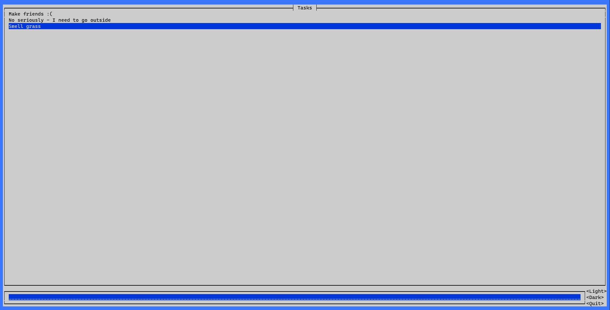
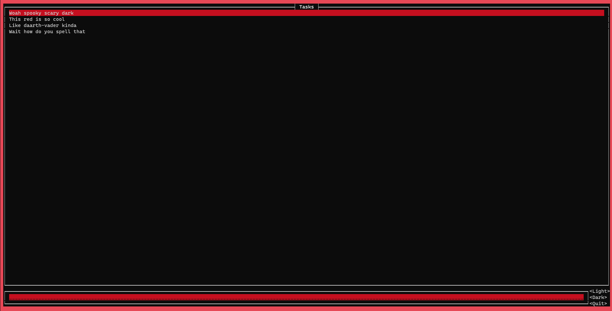

# TODO 
A simple todo app written in rust :)

## WHY❓
I was fustrated with all the current options for task-managers being so complicated and convoluted, so like any good developer, instead of contributing to a well made, perfectly functional task-manager to make it better for everyone - I made a completely new one. I also partially started this project to help me learn rust.

## RUN🏃
#### WITH CARGO🚚:
```bash
sudo apt update && sudo apt install libncurses-dev # If you are on ubuntu/debian 
git clone https://github.com/max-amb/todo.git && cd todo 
cargo run # To build and run 
```
#### WITHOUT CARGO⛔🚚:
- go to releases and download the latest binary
    - Due to the project currently being in early beta the success of this method may vary largely 😬
```bash
chmod +x {YOUR BINARY}
./{YOUR BINARY}
```

## ABOUT 🧐
* The latest version allows for addition, deletion and listing of tasks - which are stored in a file between runs
#### Command line interface 📟
* Using the command line interface looks something like this:
```bash
$ ./todo add "Take the tumbledrier out the dishwasher"
$ ./todo add "Learn rust"

$ ./todo list
1 -> Take the tumbledrier out the dishwasher
2 -> Learn rust

$ ./todo delete 1
$ ./todo list
1 -> Learn rust
```
#### GUI 🖥️
* In addition to that you can open up the gui like this:
```bash
$ ./todo gui
```
* I recommend you use the arrow keys to navigate the interface as using the cursor is unnecassarily janky
###### Themes 🎨
* There are different themes to the gui 
* A default light theme which looks like this:

* However, if you want to enter the realms of dark mode, press the *Dark* button in the corner - masterfully named I know. 
 

## FUTURE 🔮
* In the future I would like to add the following features:

- [ ] A more cohesive ui, with delete and modify buttons
- [ ] The ability to add notes and subtasks to tasks
- [ ] The ability to reorder tasks - sort of like a priority queue
- [ ] Task classification using tags
- [ ] Some sort of internet syncing